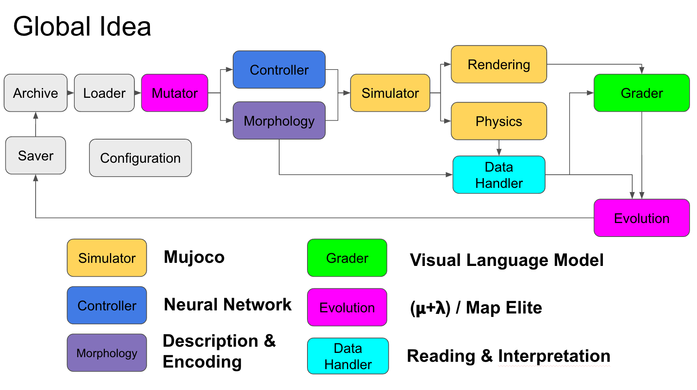

# RWS-NS-Proto

**Real-world similarity as an optimisation criterion for Quality-Diversity algorithms in morphology / motion search**

---

## Research question

When an evolutionary algorithm explores morphologies or locomotion behaviours for bio-inspired robots, how should it select the most "promising" ones?  
Humans can quickly assess whether a creature resembles something found in nature — and if it does, natural selection has likely already validated that it has interesting properties.

**Hypothesis:** using *"how much does this robot look like a real animal I know?"* as a selection criterion in a Quality-Diversity algorithm can guide evolution toward efficient, diverse, and interpretable solutions.

**Core question:** Can a VLM (Vision Language Model) that scores the visual similarity of robot morphologies/motions to real biological counterparts be used as a fitness criterion in a QD algorithm — and does it *improve* the solutions found?

**"Improve":** find solutions faster, find more diverse solutions, find more energy-efficient solutions, find more interpretable solutions.

---
## Framework



---

## Project structure

```
RWS-NS-Proto/
├── code/
│   ├── proto/                   # Proof-of-concept: locomotion evolution + VLM scoring
│   │   ├── Mujoco/              # MuJoCo simulation: physics, viewer, data recording
│   │   ├── Robot/               # Robot morphology descriptors + neural-network brain
│   │   ├── VLM/                 # Standalone VLM scoring scripts (Gemini, CLIP, Gemma)
│   │   ├── Selection/           # Archive explorer + individual selector
│   │   └── api_keys.py          # API keys (not committed)
│   │
│   └── Morphology Only/         # Main experiment: morphology-only VLM evolution
│       ├── experiment.py        # Entry point — run() and resume()
│       ├── config.py            # ExperimentConfig — all parameters
│       ├── morphology.py        # RobotMorphology + MutateMorphology
│       ├── rendering.py         # MuJoCo image renderer
│       ├── grader.py            # CLIP / Gemini graders
│       ├── evolution.py         # (μ+λ+σ) and MAP-Elites strategies
│       ├── archive.py           # Population archives
│       ├── data_handler.py      # MorphologyResult + evaluate()
│       ├── CLIP_prompts.py      # Prompt sets for CLIP grader
│       ├── gemini_prompts.py    # Prompt configs for Gemini grader
│       ├── report.py            # Human-readable run report generator
│       ├── prompt_tester.py     # Interactive prompt comparison tool
│       └── utils/
│           └── morph_generator_renderer.py  # Interactive morphology viewer
│
├── doc/                         # Research notes and references
└── rsc/                         # UI mockups and assets
```

---

## Experimental pipeline

```
ExperimentConfig
      │
      ▼
MutateMorphology ──► MorphologyRenderer ──► VLM Grader ──► fitness score
      ▲                                                           │
      └──────────── Evolution Archive ◄───────────────────────────┘
                   (MuLambda / MAP-Elites)
```

1. **Morphology** — procedural robot bodies: cylindrical torso, legs with joints, optional body parts, branching supported. Fully serialisable to MuJoCo XML.
2. **Renderer** — renders the morphology from multiple camera angles into images (no motion, no physics step required).
3. **Grader** — a VLM (CLIP or Gemini) scores the image against a natural-creature prompt. Returns a fitness ∈ [0, 1] and per-criterion scores.
4. **Archive** — stores the population; `(μ+λ+σ)` keeps the best μ each generation, MAP-Elites fills a behaviour grid.
5. **Results** — per-generation logs, archive snapshots, rendered PNGs, genealogy stream, and an auto-generated text report.

---

## Graders

| Grader | Model | Input | Notes |
|--------|-------|-------|-------|
| CLIP | ViT-B/L-14 | image + text prompts | cosine or softmax scoring |
| Gemini | gemini-3-flash / gemini-3.1-pro | image + structured prompt | returns scored dimensions + reasoning |

The Gemini grader scores three dimensions (coherence, originality, interest) with configurable weights per prompt, and returns a natural-language observation + interpretation alongside the scores.

---

## Code modules at a glance

### `code/proto/` — proof of concept

| Module | Role |
|--------|------|
| `Mujoco/` | Physics simulation of N robots in parallel, viewer, data recording, video export |
| `Robot/` | `RobotMorphology` + neural-network brain (`simple_brain.py`), save/load |
| `VLM/` | Standalone Gemini / CLIP / Gemma scoring scripts for video and image |
| `Selection/` | Archive browser and individual selector helpers |

### `code/Morphology Only/` — main experiment

See [`code/Morphology Only/help.md`](code/Morphology%20Only/help.md) for the full reference.

---

## Running an experiment

```bash
cd "code/Morphology Only"

# Default config (mu_lambda, Gemini grader, crab_morph prompt)
python experiment.py

# Custom run
python experiment.py --strategy map_elite --mu 10 --lambda_ 20 --n_gen 100

# Resume an interrupted run
python experiment.py --resume results/run_20260417_124808
```

---

## Dependencies

```
mujoco          # physics + renderer
open_clip_torch # CLIP grader
google-genai    # Gemini grader
numpy
Pillow
matplotlib
tkinter         # data analyser UI
```

---

## Status

| Component | Status |
|-----------|--------|
| Proto locomotion simulation | Done — functional baseline |
| Morphology-only VLM scoring | Done — CLIP + Gemini, μ+λ+σ + MAP-Elites |
| Genealogy tracking | Done — `individuals_log.jsonl`, `parent_id` chain |
| Interactive data analyser | Done — `utils/data_analyser.py` |
| Motion scoring (video → VLM) | In progress — proto VLM scripts exist |
| Combined morphology + motion QD | Planned |
