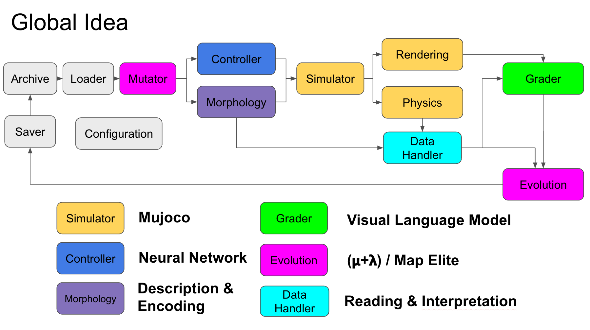

# RWS-NS-Proto

**Real-World Similarity as a selection criterion for Quality-Diversity search over robot morphologies and behaviours.**

---

## Research question

When an evolutionary algorithm explores morphologies or locomotion behaviours
for bio-inspired robots, how should it decide which candidates are "promising"?
Humans can quickly judge whether a creature resembles something found in nature —
and if it does, natural selection has likely already validated that the design
has useful properties.

**Hypothesis.** Using *"how much does this robot look/move like a real animal?"*
as a selection criterion in a Quality-Diversity (QD) algorithm can guide
evolution toward efficient, diverse, and interpretable solutions.

**Core question.** Can a Vision-Language Model (VLM) that scores the visual
similarity of a robot's morphology or motion to a real biological counterpart be
used as a fitness signal in a QD algorithm — and does it *improve* the solutions
found (found faster, more diverse, more efficient, more interpretable)?



---

## Repository layout

All source lives under `code/`, split into **four self-contained parts**. Each
part has its own `README.md`, its own `requirements.txt`, and its own `config`.

```
RWS-NS-Proto/
├── README.md                 ← you are here (global setup + overview)
├── GlobalFramework.png        framework figure
└── code/
    ├── _api_keys.py           API-key template  →  copy to  code/api_keys.py
    │
    ├── proto/                 1. Proof of concept  (CPU)
    ├── Morphology/            2. Morphology QD via VLM on static renders  (CPU)
    ├── Controller/            3. Controller QD via VLM on motion videos  (CPU, laptop)
    └── Controller_MJX/        4. Controller QD, GPU-accelerated (MJX/JAX)  (GPU)
```

| # | Part | What it does | Hardware | Guide |
|---|------|--------------|----------|-------|
| 1 | **`proto/`** | Original proof of concept: evolve neural-network locomotion controllers in MuJoCo and score them with standalone VLM/CLIP scripts. | Laptop / CPU | [code/proto/README.md](code/proto/README.md) |
| 2 | **`Morphology/`** | Evolve robot **bodies**; a VLM (Gemini or CLIP) scores each rendered morphology for similarity to a target creature. `(μ+λ)` and MAP-Elites. | Laptop / CPU | [code/Morphology/README.md](code/Morphology/README.md) |
| 3 | **`Controller/`** | Evolve locomotion **behaviours**; each candidate trains a PPO policy, is filmed, and a VLM scores the motion video. Stable-Baselines3 on CPU. *Superseded by `Controller_MJX/`.* | Laptop / CPU | [code/Controller/README.md](code/Controller/README.md) |
| 4 | **`Controller_MJX/`** | The same controller study, re-implemented on **MJX/JAX** so thousands of environments run in parallel on a GPU. This is the version used for full-scale runs. | **GPU** (CUDA) | [code/Controller_MJX/README.md](code/Controller_MJX/README.md) |

**How the parts relate.** `proto/` is the exploratory prototype. `Morphology/`
and `Controller/` are the two clean study branches (bodies vs. behaviours) that
grew out of it and share the same experiment skeleton (`config → mutate →
render → VLM grade → archive`). `Controller_MJX/` is a GPU port of
`Controller/`: same pipeline and output layout, but the physics and PPO inner
loop are JAX-compiled and massively parallel.

---

## Global setup

### 1. Requirements

- **Python 3.10+** (developed and tested on 3.12).
- A **Google Gemini API key** (the free tier is enough to get started) — this is
  the VLM grader used by parts 2–4. Create one at
  <https://aistudio.google.com/api-keys>.
- For **part 4 (`Controller_MJX/`)**: a **CUDA GPU** for realistic runs (it also
  runs on CPU / Apple Metal for small tests). See its README for the JAX install.

### 2. Get the code and create an environment

```bash
git clone <this-repo-url>
cd RWS-NS-Proto
python -m venv .venv && source .venv/bin/activate     # or: conda create -n rws python=3.12
```

### 3. Add your API key  ← required

The file `code/api_keys.py` is **not** included (it is git-ignored because it
holds private keys). A template is provided instead:

```bash
cp code/_api_keys.py code/api_keys.py
```

Then edit `code/api_keys.py` and paste your key(s):

```python
APIKEY_GEMINI     = "AIza...your-gemini-key..."      # required for parts 2, 3, 4
APIKEY_OPENROUTER = "put-your-openrouter-api-key"    # optional (proto/VLM/Gemma.py only)
```

Every script loads the key from this file automatically; you never pass it on
the command line. Keep `api_keys.py` private — do **not** commit it.

### 4. Install dependencies (per part)

Each part lists exactly what it needs. Install only the part(s) you plan to run:

```bash
pip install -r code/proto/requirements.txt            # part 1
pip install -r code/Morphology/requirements.txt       # part 2
pip install -r code/Controller/requirements.txt       # part 3
# part 4: install JAX for your platform first (see its README), then:
pip install -r code/Controller_MJX/requirements.txt   # part 4
```

> **Working directory matters.** Each part is run from *inside its own folder*
> (e.g. `cd code/Morphology && python experiment.py`). The scripts add `code/`
> to the import path themselves so that `from api_keys import ...` resolves — so
> always launch from the part's directory, not from the repository root.

---

## Running an experiment (quick tour)

Each part is documented in full in its own README. In short:

```bash
# 2. Morphology — evolve bodies, score renders with Gemini
cd code/Morphology
python experiment.py                       # uses defaults in config.py
python experiment.py --strategy map_elite --n_gen 50

# 3. Controller (laptop) — evolve behaviours, score videos with Gemini
cd code/Controller
python experiment.py --n_gen 10

# 4. Controller_MJX (GPU) — same study, parallelised on the GPU
cd code/Controller_MJX
CUDA_VISIBLE_DEVICES=0 python experiment_mjx.py --n_gen 20
```

**Configuration.** Every part is driven by a single `config.py` holding an
`ExperimentConfig` dataclass. Edit the defaults there for full control; a handful
of common parameters can also be overridden with command-line flags. At the start
of each run the resolved config is frozen to `config.json` inside the run folder,
so any experiment can be reproduced exactly.

**Outputs.** Results are written under each part's `results/<run_id>/` folder
(archives, per-generation logs, rendered PNGs or rollout MP4s, and the frozen
`config.json`). These folders are git-ignored.

---

## Reproducibility notes

- Every run is defined by its `ExperimentConfig` and a `seed`; the config is
  saved to `results/<run_id>/config.json`.
- The VLM grader (Gemini) is stochastic: identical inputs can yield slightly
  different scores. Parts that depend heavily on it average several requests per
  batch (`n_score_request`) to reduce variance. Use `--fake-grader` /
  `use_fake_grader` to exercise the full pipeline without any API calls.
- GPU results (part 4) depend on the JAX / driver build; pin your environment for
  publication-grade reproducibility (`pip freeze > frozen-requirements.txt`).

---

## Citation / License

If you use this code, please cite the accompanying paper *(add reference here)*
and add a `LICENSE` file before publishing.
